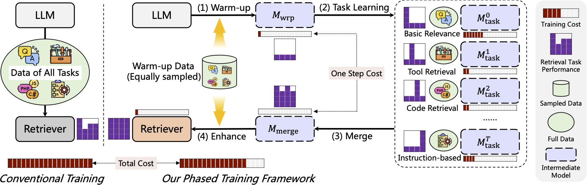

<div align="center">
<h1>[COLM 2025] Phased Training for LLM-powered Text Retrieval Models Beyond Data Scaling</h1> 
</div>

<p align="center">
<a href="https://openreview.net/pdf?id=NC6G1KCxlt">
  </a> 
<a href="https://opensource.org/license/mit">
  </a> 
<a href="https://github.com/vec-ai/lychee-embed/pulls">
    </a>
</p>

[Paper copy](./assets/colm25-paper-lychee.pdf)

## Introduction
We introduce a multi-stage framework for training generalist text embedding and reranking models.
The conventional training approach typically mixes all different types of data together and performs single-stage multi-task training, which faces challenges of data imbalance and task conflicts.
Moreover, any adjustment requires re-running the entire training process.
To address these challenges, our framework first learns each retrieval task independently, followed by model merge and enhance phases, enabling a more efficient training process

</a>  <!-- height="320px" -->


## Model Card
By this framework, we develop the `lychee-embed` and `lychee-rerank` models for various text embedding and reranking tasks.

- Language Support: 100+ Languages
- Param Size: 1.5B
- Context Length: 8k in training, you could extend up to 32k
- Model Precision: BF16
- Embedding Model: `lychee-embed`
  - Embedding Dim: 1536, Supports diverse settings with 32 steps from 32 to 1536
  - Huggingface: https://huggingface.co/vec-ai/lychee-embed
  - Modelscope: https://modelscope.cn/models/vec-ai/lychee-embed
- Reranking Model: `lychee-rerank`
  - Huggingface: https://huggingface.co/vec-ai/lychee-rerank
  - Modelscope: https://modelscope.cn/models/vec-ai/lychee-rerank


## Evaluation

### Embedding 

| Model | Param | MTEB | CMTEB | MMTEB | MLDR | MTEB-Code | ToolBench | FollowIR | BRIGHT |
|---|---|---|---|---|---|---|---|---|---|
| BGE-multilingual | 9.24B  | 69.88 | 68.44 | 61.25  | 49.10 | 62.04  | 63.65  | -2.13 | 17.68 |
| NV-Embed-v2  | 7.85B  | 72.31  | - | 56.25 | - | 63.74 | 50.54 | 1.04 | 19.28 |
| GritLM-7B | 7.24B  | 66.8 | - | 60.93 | - | 73.6 | 35.42 | 3.45 | 20.63 |
| E5-mistral    | 7.11B  | 66.6 | 59.92 | 60.28 | - | 69.2 | 31.79 | -0.62 | 17.54 |
| GTE-Qwen2-7B     | 7.62B  | 69.88 | 71.62 | 62.51 | 56.53 | 62.17 | 59.48 | 4.94 | 22.89 |
| GTE-Qwen2-1.5B   | 1.54B  | 67.19 | 67.12 | 59.47 | 52.11 | 61.98 | 62.57 | 0.74 | 18.47 |
| BGE-M3 (Dense)             | 0.56B  | 59.84 | 61.79 | 59.54 | 52.50 | 58.22  | 58.45 | -3.11 | 11.94 |
| Jina-v3                   | 0.57B  | 65.52 | 63.07 | 58.37 | 40.71 | 58.85 | 59.64 | -1.34 | 11.34 |
|Qwen3-Embedding-8B | 7.57B | | 73.84 | 70.58 | | 80.68 |
|Qwen3-Embedding-4B | 4.02B | | 72.27 | 69.45 | | 80.06 |
|Qwen3-Embedding-0.6B | 0.60B | | 66.33 | 64.33 | | 75.41 |
| **Lychee-embed** | 1.54B | 68.39 |69.77 | 58.43 | 53.85 | 72.54 | 86.35 | 5.74 | 19.47 |


### Reranking

| Model | Param | MTEB-R | CMTEB-R | MMTEB-R | MLDR | MTEB-Code | ToolBench | FollowIR | BRIGHT |
|---|---|---|---|---|---|---|---|---|---|
| **Lychee-embed** | 1.54B | 68.39 |69.77 | 58.43 | 53.85 | 72.54 | 86.35 | 5.74 | 19.47 |
||
| Jina-multilingual-reranker-v2-base | 278M | 54.61 | 70.18 | 54.43 | 50.32 | 46.32 | 67.80 | -0.69 | 16.69  |
| mGTE-reranker | 304M | 55.71 | 72.01 | 56.61 | 61.40 | 45.92 | 67.58 | -1.14 | 10.76 |
| BGE-reranker-v2-m3 | 568M | 55.36 | 71.82 | 57.13 | 60.80 | 50.81 | 62.52	| -0.06	| 15.87 |
| BGE-reranker-v2-gemma | 9.24B | 60.81 | 71.74 | 69.80 | 49.10 | 68.63 | 68.14 | -2.13	| 17.68  |
| **Lychee-rerank** | 1.54B  | 59.56 | 76.37 | 62.47 | 64.09 | 78.03 | 90.82 | 7.38 | 16.92 |


For more details, please refer to our [Paper](https://openreview.net/pdf?id=NC6G1KCxlt).

<!-- ## Todo

- [ ] Release code for model training.
- [x] Release code for evaluation.
- [x] Release code for data curation. -->


## Cite
```
@inproceedings{zhang2025phased,
title={Phased Training for LLM-powered Text Retrieval Models Beyond Data Scaling},
author={Xin Zhang and Yanzhao Zhang and Wen Xie and Dingkun Long and Mingxin Li and Pengjun Xie and Meishan Zhang and Wenjie Li and Min Zhang},
booktitle={Second Conference on Language Modeling},
year={2025},
url={https://openreview.net/forum?id=NC6G1KCxlt}
}
```
